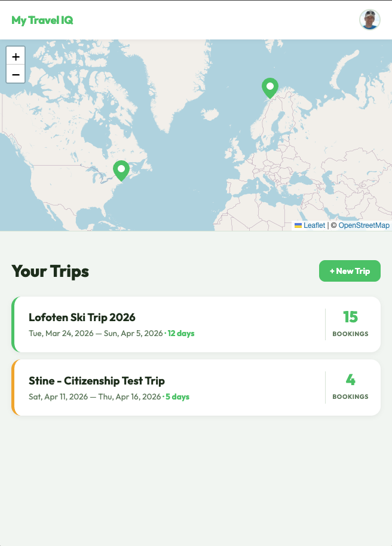
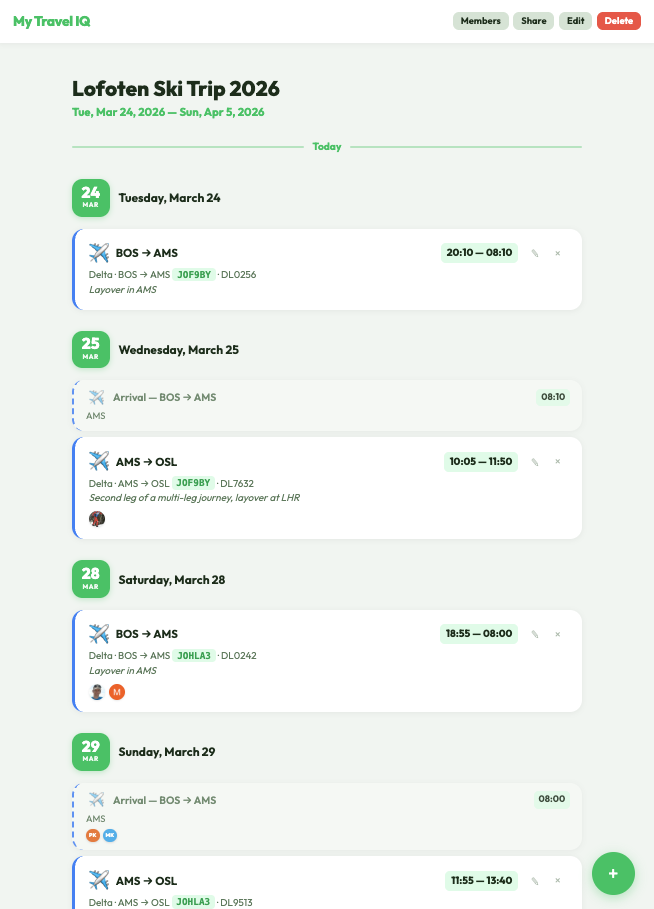

# My Travel IQ

A personal travel-itinerary manager that lives entirely on Cloudflare's free tier. Paste a confirmation email, drop in a PDF, or type details manually — the app uses AI to parse the booking and adds it to a structured, shareable trip timeline.

**Live app:** https://my-travel-iq.philipp-koch.workers.dev

---

## Screenshots

| Login | Dashboard | Trip Timeline |
|---|---|---|
|  |  |  |

---

## Features

- **AI-powered import** — paste raw booking emails or upload PDFs; Cloudflare Workers AI (Llama 3) extracts flights, hotels, car rentals, trains, restaurants, and more
- **Trip timeline** — chronological itinerary with per-segment icons, confirmation numbers, and provider details
- **World map** — interactive Leaflet map on the dashboard showing pinned destinations across all trips
- **Traveler management** — assign colour-coded traveler profiles to individual segments
- **Shareable links** — generate a public read-only share URL for any trip
- **Google OAuth** — one-click sign-in, no passwords stored
- **Fully serverless** — Cloudflare Worker + D1 (SQLite) + R2 (file storage) + Workers AI

---

## Tech Stack

| Layer | Technology |
|---|---|
| Runtime | Cloudflare Workers |
| Framework | [Hono](https://hono.dev) |
| Database | Cloudflare D1 (SQLite) |
| File storage | Cloudflare R2 |
| AI extraction | Cloudflare Workers AI (Llama 3.3 70B) |
| Auth | Google OAuth 2.0 |
| Frontend | Vanilla JS + CSS (no build step) |
| Maps | Leaflet + OpenStreetMap |

---

## Project Structure

```
my-travel-iq/
├── src/
│   ├── index.js          # Worker entry point, route wiring
│   ├── middleware/        # Auth middleware
│   └── routes/
│       ├── auth.js        # Google OAuth flow
│       ├── trips.js       # Trip CRUD
│       ├── segments.js    # Booking segments CRUD
│       ├── extract.js     # AI extraction endpoint
│       ├── travelers.js   # Traveler profiles
│       ├── members.js     # Trip membership
│       ├── shares.js      # Public share links
│       └── destinations.js# Map pin data
│   └── services/
│       ├── ai-extractor.js # Workers AI prompt & parsing
│       └── pdf-processor.js# PDF → text via R2
├── public/               # Static assets served by Workers Assets
│   ├── index.html        # Dashboard
│   ├── trip.html         # Trip detail / timeline
│   ├── add.html          # Add booking page
│   ├── share.html        # Public share view
│   ├── login.html        # Login page
│   ├── css/style.css
│   └── js/
├── schemas/
│   └── schema.sql        # D1 table definitions
├── wrangler.toml         # Cloudflare config
└── package.json
```

---

## Local Development

### Prerequisites

- [Node.js](https://nodejs.org) 18+
- [Wrangler CLI](https://developers.cloudflare.com/workers/wrangler/) — `npm install -g wrangler`
- A Cloudflare account (free tier is sufficient)
- A Google Cloud project with OAuth 2.0 credentials

### 1. Clone & install

```bash
git clone https://github.com/pkoch73/my-travel-iq.git
cd my-travel-iq
npm install
```

### 2. Create Cloudflare resources

```bash
# D1 database
wrangler d1 create my-travel-iq-db

# R2 bucket
wrangler r2 bucket create my-travel-iq-uploads
```

Copy the `database_id` from the D1 output into `wrangler.toml`.

### 3. Configure secrets

Create a `.dev.vars` file (never committed):

```env
GOOGLE_CLIENT_ID=your-google-client-id
GOOGLE_CLIENT_SECRET=your-google-client-secret
SESSION_SECRET=any-long-random-string
```

For production, set these with Wrangler:

```bash
wrangler secret put GOOGLE_CLIENT_ID
wrangler secret put GOOGLE_CLIENT_SECRET
wrangler secret put SESSION_SECRET
```

### 4. Apply the database schema

```bash
# Local (dev)
npm run db:migrate:local

# Remote (production)
npm run db:migrate:remote
```

### 5. Run locally

```bash
npm run dev
```

Wrangler starts a local server at `http://localhost:8787` with a local D1 instance.

---

## Deployment

```bash
npm run deploy
```

Wrangler bundles the Worker, uploads static assets, and deploys everything in one step.

---

## Google OAuth Setup

1. Go to [Google Cloud Console](https://console.cloud.google.com) → APIs & Services → Credentials
2. Create an **OAuth 2.0 Client ID** (Web application)
3. Add authorised redirect URIs:
   - `http://localhost:8787/auth/google/callback` (local)
   - `https://<your-worker>.workers.dev/auth/google/callback` (production)
4. Copy the Client ID and Secret into `.dev.vars` / Wrangler secrets
